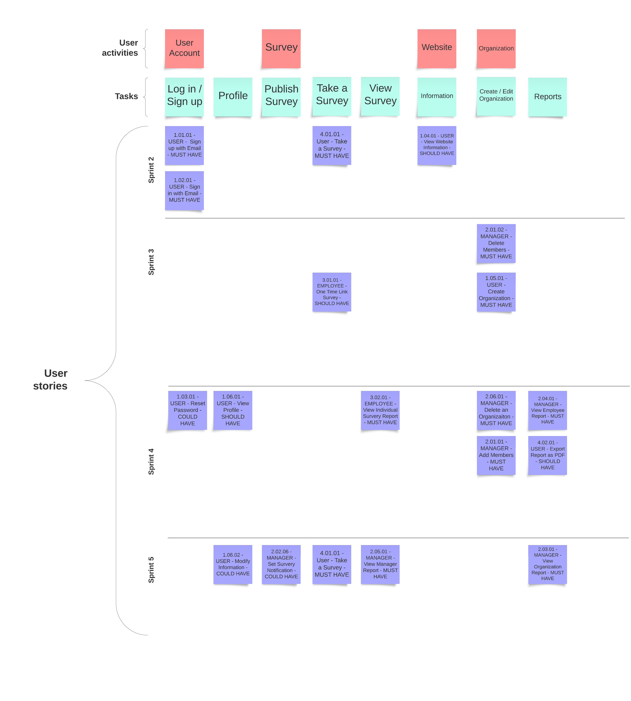

# Project Management

## Story Map

## Project Plan

### Sprint 1

_Due: October 1_

#### Tasks

| **Task**                                 | **Related US** | **Assigned To**                           | **Due Date** |
| ---------------------------------------- | -------------- | ----------------------------------------- | ------------ |
| Executive Summary and Project Glossary   | Documentation  | Thea                                      | Sept. 27     |
| User Stories                             | Documentation  | Irene, Thea                               | Oct. 1       |
| MoSCoW                                   | Documentation  | Irene, Thea                               | Oct. 1       |
| Similar Products and Technical Resources | Documentation  | Thea                                      | Oct. 1       |
| Architecture Diagram                     | Documentation  | Othman                                    | Sept. 27     |
| Sequence Diagram                         | Documentation  | Leah                                      | Oct. 1       |
| Low-Fidelity User Interface              | Documentation  | Thea                                      | Sept. 27     |
| Story Map                                | Documentation  | Jaskirat                                  | Sept. 28     |
| Project Plan                             | Documentation  | Alex                                      | Sept. 29     |
| Team Canvas                              | Documentation  | Alex, Irene, Jaskirat, Leah, Othman, Thea | Oct. 1       |
| Scrum Roles and Belbin Team Roles        | Documentation  | Alex, Jaskirat                            | Sept. 27     |
| Meeting Minutes                          | Documentation  | Alex                                      | Oct. 1       |
| Setup MkDocs                             | Documentation  | Alex                                      | Sept. 30     |

### Sprint 2

_Due: October 14_

#### User stories

| **User story**                               | **Story points** |
| -------------------------------------------- | ---------------- |
| SETUP - Setting up dev environment           | 5                |
| SETUP - Set up the APIs and routing          | 8                |
| US 1.01.01 - User - Sign Up with Email       | 5                |
| US 1.02.01 - User - Sign In with Email       | 3                |
| US 1.04.01 - User - View Website Information | 1                |
| US 4.01.01 - User - Take a Survey            | 8                |

Estimated sprint velocity: **30**

#### Tasks

| **Task**                                  | **Related US**         | **Assigned To** | **Due Date** |
| ----------------------------------------- | ---------------------- | --------------- | ------------ |
| PostgreSQL database, Node.js server setup | SETUP                  | Othman          | Oct. 6       |
| React, Node.js setup                      | SETUP                  | Thea            | Oct. 4       |
| Cybera, GitHub actions setup              | SETUP                  | Alex            | Oct. 6       |
| Create user account                       | US 1.01.01             | Othman          | Oct. 8       |
| User authentication (login)               | US 1.02.01             | Alex            | Oct. 8       |
| TSX/CSS for login                         | US 1.01.01, US 1.02.01 | Leah            | Oct. 8       |
| Website information (landing page)        | US 1.04.01             | Thea            | Oct. 8       |
| TSX for survey creation                   | US 2.02.01             | Leah            | Oct. 11      |
| CSS for survey creation                   | US 2.02.01             | Leah            | Oct. 11      |
| REST API endpoints for survey creation    | SETUP                  | Jaskirat        | Oct. 11      |
| Publish survey to employees               | SETUP                  | Jaskirat        | Oct. 14      |
| TSX for taking surveys                    | US 4.01.01             | Thea            | Oct. 14      |
| CSS for taking surveys                    | US 4.01.01             | Thea            | Oct. 14      |
| REST API endpoints for taking surveys     | SETUP, US 4.01.01      | Alex, Irene     | Oct. 14      |
| UML Class Diagram                         | Documentation          | Leah            | Oct. 14      |
| Updating documentation                    | Documentation          | Alex, Irene     | Oct. 14      |

### Sprint 3

_Due: October 28_

#### User stories

| **User story**                                        | **Story points** |
| ----------------------------------------------------- | ---------------- |
| US 1.05.01 - User - Create Organization               | 3                |
| US 2.01.01 - Manager - Add Members                    | 1                |
| US 2.01.02 - Manager - Delete Members                 | 1                |
| US 4.01.01 - User - Take a Survey                     | 8                |
| US 2.02.04 - Manager - Set Survey Visibility          | 1                |
| US 2.04.01 - Manager - View Employee Report           | 8                |
| US 3.01.01 - Employee - One Time Link Survey          | 5                |
| US 3.02.01 - Employee - View Individual Survey Report | 8                |

Estimated sprint velocity: **35**

| **Task**                                                | **Related US**         | **Assigned To** | **Due Date** |
| ------------------------------------------------------- | ---------------------- | --------------- | ------------ |
| Create organization                                     | US 1.05.01             | Jaskirat        | Oct. 26      |
| Add members to organization (Excel)                     | US 2.01.01             | Alex            | Oct. 23      |
| Delete members from organization                        | US 2.01.02             | Alex            | Oct. 25      |
| TSX for organization members                            | US 2.01.01, US 2.01.02 | Irene           | Oct. 23      |
| CSS for organization members                            | US 2.01.01, US 2.01.02 | Irene           | Oct. 23      |
| Refactor take survey functionality to integrate backend | US 4.01.01             | Leah            | Oct. 28      |
| Set survey visibility                                   | US 2.02.04             | Jaskirat        | Oct. 23      |
| TSX for employee reports                                | US 2.04.01             | Alex, Irene     | Oct. 28      |
| CSS for employee reports                                | US 2.04.01             | Alex, Irene     | Oct. 28      |
| Create one time survey link                             | US 3.01.01             | Othman          | Oct. 28      |
| Send one time survey link via email                     | US 3.01.01             | Othman          | Oct. 28      |
| TSX for individual survey reports                       | US 3.02.01             | Alex, Irene     | Oct. 28      |
| CSS for individual survey reports                       | US 3.02.01             | Alex, Irene     | Oct. 28      |
| Deploy API docs                                         | N/A                    | Jaskirat        | Oct. 28      |

#### Tasks

Sprint 3 tasks will be added during Spring 2.

### Sprint 4

_Due: November 18_

#### User stories

| **User story**                                        | **Story points** |
| ----------------------------------------------------- | ---------------- |
| US 1.03.01 - User - Reset Password                    | 5                |
| US 1.06.01 - User - View Profile                      | 3                |
| US 2.01.01 - Manager - Add Members                    | 3                |
| US 2.02.06 - Manager - Set Survey Notification        | 3                |
| US 2.03.01 - Manager - View Organization Report       | 5                |
| US 2.04.01 - Manager - View Employee Report           | 3                |
| US 2.05.01 - Manager - View Manager Report            | 3                |
| US 2.06.01 - Manager - Delete an Organization         | 3                |
| US 3.02.01 - Employee - View Individual Survey Report | 3                |
| US 4.01.01 - User - Take a Survey                     | 8                |
| US 4.02.01 - User - Export Report to PDF              | 5                |

Estimated sprint velocity: **44**

#### Tasks

| **Task**                                               | **Related US** | **Assigned To** | **Due Date** |
| ------------------------------------------------------ | -------------- | --------------- | ------------ |
| Reset password (frontend + backend)                    | US 1.03.01     | Othman          | Nov. 16      |
| TSX for profile page                                   | US 1.06.01     | Leah            | Nov. 16      |
| CSS for profile page                                   | US 1.06.01     | Leah            | Nov. 16      |
| REST API endpoints for profile page                    | US 1.06.01     | Jaskirat        | Nov. 16      |
| Add critical positions to Excel file                   | US 2.01.01     | Alex            | Nov. 11      |
| Add error handling to add members functionality        | US 2.01.01     | Alex            | Nov. 11      |
| Set survey notification (frontend + backend)           | US 2.02.06     | Alex            | Nov. 11      |
| TSX for organization reports                           | US 2.03.01     | Alex            | Nov. 16      |
| CSS for organization reports                           | US 2.03.01     | Alex            | Nov. 16      |
| REST API endpoints for organization reports            | US 2.03.01     | Othman          | Nov. 16      |
| REST API endpoints for employee reports                | US 2.04.01     | Othman          | Nov. 16      |
| TSX for manager reports                                | US 2.05.01     | Alex            | Nov. 16      |
| CSS for manager reports                                | US 2.05.01     | Alex            | Nov. 16      |
| REST API endpoints for manager reports                 | US 2.05.01     | Othman          | Nov. 16      |
| Delete an organization (frontend + backend)            | US 2.06.01     | Jaskirat        | Nov. 16      |
| REST API endpoints for individual survey reports       | US 3.02.01     | Othman          | Nov. 16      |
| Connect surveys (employee/manager, company) to backend | US 4.01.01     | Leah            | Nov. 18      |
| Add images for each survey question                    | US 4.01.01     | Leah            | Nov. 18      |
| UI for company survey                                  | US 4.01.01     | Leah            | Nov. 18      |
| Export report to PDF                                   | US 4.02.01     | Irene           | Nov. 18      |
| UI Tests                                               | N/A            | Irene           | Nov. 18      |

### Sprint 5

_Due: December 2_

#### User stories

| **User story**                                  | **Story points** |
| ----------------------------------------------- | ---------------- |
| RELEASE - Prepare MVP for release               | 5                |
| TESTING - Complete UI Tests and test backend    | 5                |
| US 1.06.02 - User - Modify Information          | 3                |
| US 2.02.06 - Manager - Set Survey Notification  | 1                |
| US 2.03.01 - Manager - View Organization Report | 1                |
| US 2.05.01 - Manager - View Manager Report      | 1                |
| US 4.01.01 - User - Take a Survey               | 5                |

Estimated sprint velocity: **21**

#### Tasks

| **Task**                                     | **Related US**        | **Assigned To**  | **Due Date** |
| -------------------------------------------- | --------------------- | ---------------- | ------------ |
| Deployment                                   | RELEASE               | Alex, Jaskirat   | Nov. 25      |
| Installation Documentation                   | RELEASE               | Alex, Irene      | Dec. 2       |
| Update API docs                              | RELEASE               | Jaskirat         | Nov. 25      |
| Testing (Frontend)                           | TESTING               | Irene, Leah      | Dec. 2       |
| Testing (Backend)                            | TESTING               | Jaskirat, Othman | Dec. 2       |
| Edit name (frontend + backend)               | US 1.06.02            | Jaskirat         | Nov. 25      |
| Set up notification service                  | US 2.02.06            | Othman           | Dec. 2       |
| Calculate position balance and company GAP   | US 2.03.01/US 2.05.01 | Alex, Othman     | Dec. 2       |
| Add questions from Yohana's email to surveys | US 4.01.01            | Alex             | Nov. 25      |
| Connect surveys to backend                   | US 4.01.01            | Alex, Leah       | Dec. 2       |
| UI for company survey                        | US 4.01.01            | Leah             | Dec. 2       |
